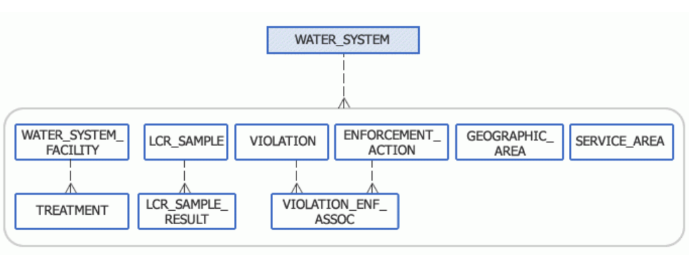
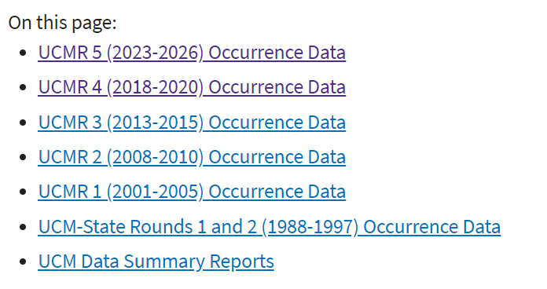
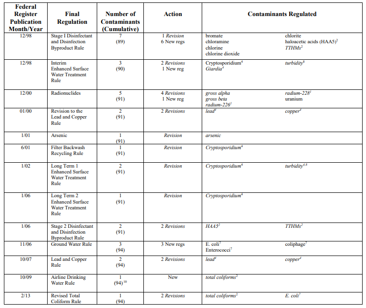
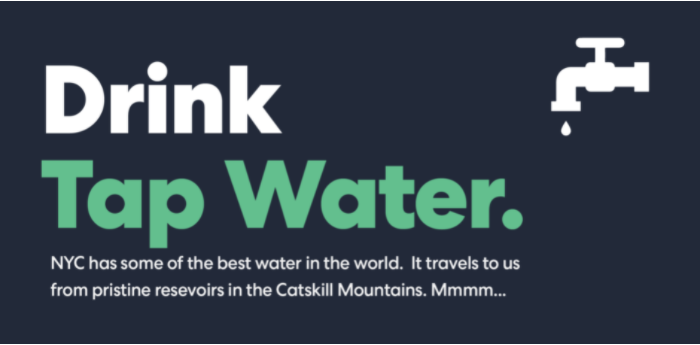
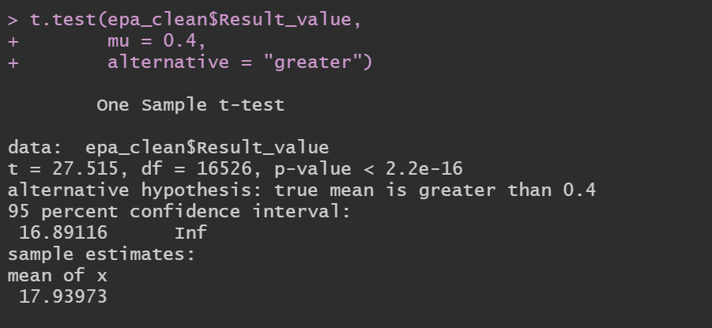

```{r setup, include=FALSE}
knitr::opts_chunk$set(echo = TRUE)
```

## Quality of Drinking Water 
## Overview{.tabset .tabset-pills}
### Overview

**OBTAINING DRINKING WATER DATA FROM THE ENVIRONMENTAL PROTECTION AGENCY - EPA**

****

Water is an essential factor for the whole life and the human survival and, having an important role for both drinking as well economic sectors. Therefore, protecting this source against any pollution has become necessary (Witek and Jarosiewicz, 2009, Reza and Singh, 2010; Sojobi, 2016). In the last century, the availability and quality of surface or ground waters have been changing, mainly due to urbanization, industrialization etc.


**Using ENVIROFACTS -  API**

**SDWIS - Safe Drinking Water Information System**

****

Information about safe drinking water is stored in SDWIS, the EPA's Safe Drinking Water Information System. SDWIS tracks information on drinking water contamination levels as required by the 1974 Safe Drinking Water Act and its 1986 and 1996 amendments. The Safe Drinking Water Act (SDWA) and accompanying regulations establish Maximum Contaminant Levels (MCLs), treatment techniques, and monitoring and reporting requirements to ensure that water provided to customers is safe for human consumption. 



****

**UCMR - Unregulated Contaminant Monitoring Rule**

****

EPA collects data for chemicals and microbes that may be present in drinking water, but are not currently subject to EPA drinking water regulations.

The UCMR program was developed in coordination with the Contaminant Candidate List (CCL) a list of contaminants that:

- Are not regulated by the National Primary Drinking Water Regulations

- Are known or anticipated to occur at public water systems

- May warrant regulation under the SDWA





### Packages

```{r packages, message=FALSE, warning=FALSE}

library(plyr)
library(knitr)
library(readr)
library(tidyverse)
library(tidymodels)
library(DT)
library(dplyr)
library(textrecipes)
library(ggplot2)
library(lubridate)
set.seed(1234)

```

### Data
#### {.tabset}
##### API_data


**Dataset # 1 - Using API**

****

Safe Drinking Water Information System (SDWIS)

The Safe Drinking Water Information System (SDWIS) contains information about public water systems and their violations of EPA's drinking water regulations. Searching SDWIS will allow you to locate your drinking water supplier and view its violations and enforcement history for the last ten years.


```{r load data 1, warning=FALSE, eval=FALSE}
# EPA API
#change import way

#URL <- ("https://data.epa.gov/efservice/VIOLATION/CSV")

library(readr)

api_data <- read_csv("data/EnvirofactsRestAP_violations.csv")


```

##### EPA_data

**Dataset # 2 - UCMR.Csv** 

****

What are the public health benefits of UCMR?
This permits assessment of the population being exposed and the levels of exposure.

UCMR data represent one of the primary sources of national occurrence data in drinking water that EPA uses to inform regulatory and other risk management decisions for drinking water contaminant candidates.


```{r load data 2, eval=FALSE}
library(readr)

water_data <- read_delim("data/UCMR4_All_MA_WY.txt", 
    "\t", escape_double = FALSE, locale = locale(encoding = "Latin1"), 
    trim_ws = TRUE)
names(water_data)
```

##### Exploratory Analysis

**Dataset 1 - APi Data**

****


```{r api water, eval=FALSE}
library(dplyr)

api_water <- api_data %>% 
  select(Facility_name = VIOLATION.PWSID,
         Pop_served = VIOLATION.POPULATION_SERVED_COUNT,
         State = VIOLATION.PRIMACY_AGENCY_CODE,
         Health = VIOLATION.IS_HEALTH_BASED_IND,
         Contaminant = VIOLATION.CONTAMINANT_CODE,
         Result_value = VIOLATION.VIOL_MEASURE,
         State_MCL = VIOLATION.STATE_MCL)
```

```{r api clean, eval=FALSE}

library(tidyr)
api_clean <- api_water %>% 
  drop_na()

```

```{r write csv, echo=FALSE, message=FALSE, eval=FALSE}
library(readr)

write_csv(api_clean,"api_clean.csv", col_names = TRUE)
```

```{r, echo=FALSE, message=FALSE,warning=FALSE}

library(readr)

api_clean2 <- read_csv("api_clean2.csv")

```

```{r clean skim, warning=FALSE}
library(skimr)
library(ggplot2)

 api_clean2 %>% skim()
 
```


**Dataset 2 - Contaminant Monitoring UCMR**

****

```{r epa water, eval=FALSE}
epa_water <- water_data %>% 
  select(PWSName,
         Size,
         FacilityName,
         FacilityWaterType,
         CollectionDate,
         Contaminant,
         MRL,
         Result = AnalyticalResultsSign,
         Result_value = `AnalyticalResultValue(µg/L)`,
         State)
  
```

```{r epa water tidy, eval= FALSE, message=FALSE, warning=FALSE}

library(plyr)
library(lubridate)

epa_water <- epa_water %>% 
  mutate(Result = replace(Result, Result == "=", TRUE),
         Date = mdy(CollectionDate),
         CollectionDate = NULL) %>% 
  mutate(MRL = as.numeric(MRL))

```

```{r epa clean, eval=FALSE}

library(tidyr)

epa_clean <- epa_water %>% 
  drop_na()
```

```{r epa write csv, echo=FALSE, message=FALSE, eval=FALSE}
library(readr)

write_csv(epa_clean,"epa_clean.csv", col_names = TRUE)

```
```{r}

epa_clean <- read_csv("epa_clean.csv")
```

```{r, eval=FALSE}

library(lubridate)

epa_clean <- epa_clean %>% 
  mutate(Date = ymd(Date))

```

```{r skim ucmr}

library(skimr)
library(ggplot2)

 epa_clean %>% skim()
```

##### Relationships

Correlation is a measure of the relationship or interdependence of two variables. In other words, how much do the values of one variable change with the values of another. Correlation can be either positive or negative and it ranges from -1 to 1, with 1 and -1 indicating perfect correlation (1 being positive and -1 being negative) and 0 indicating no correlation.

**Dataset 1 - APi Data**

****

```{r analytics, warning=FALSE, message=FALSE}

library(PerformanceAnalytics)

api_clean2 %>% 
  select_if(is.numeric) %>% 
  chart.Correlation()

```

```{r ggally, warning=FALSE,message=FALSE}

library(GGally)

api_clean2 %>% 
  select_if(is.numeric) %>% 
  ggcorr(label = TRUE)

```

```{r}
library(GGally)

api_clean2 %>% 
  select_if(is.numeric) %>% 
  ggpairs()
```

****

**Dataset 2 - APi Data**

****

```{r analytics2, warning=FALSE, message=FALSE}

library(PerformanceAnalytics)

epa_clean %>% 
  select_if(is.numeric) %>% 
  chart.Correlation()

```

```{r ggally2, warning=FALSE,message=FALSE}

library(GGally)

epa_clean %>% 
  select_if(is.numeric) %>% 
  ggcorr(label = TRUE)

```

```{r}
library(GGally)

epa_clean %>% 
  select_if(is.numeric) %>% 
  ggpairs()
```

##### Contaminants

**MOST RECENT REGULATED contaminants by the EPA**

****



[Regulated contaminants](https://www.epa.gov/sites/production/files/2015-10/documents/dw_regulation_timeline.pdf)

****

**REGULATED CONTAMINANTS VIOLATIONS - States with levels higher than the  Maximum Concentration Levels**

****

```{r, message=FALSE, warning=FALSE}

library(ggplot2)

ggplot(api_clean2) +
 aes(x = State_MCL, size = Result_value) +
 geom_histogram(bins = 30L, fill = "#FF8C00") +
 scale_x_continuous(trans = "log10") +
 theme_minimal() +
 facet_wrap(vars(State))

```

****

**UNREGULATED CONTAMINANTS -  > Maximum Concentration Levels (MCL) by State**

****

The Safe Drinking Water Act (SDWA) defines "contaminant" as any physical, chemical, biological or radiological substance or matter in water. Drinking water may reasonably be expected to contain at least small amounts of some contaminants. Some contaminants may be harmful if consumed at certain levels in drinking water. The presence of contaminants does not necessarily indicate that the water poses a health risk.

```{r contaminants, echo=FALSE, message=FALSE, warning=FALSE}
library(readr)
epa_clean2 <- read_csv("data/UCMR 4_Data Summary.csv", 
    na = "NA")

```

```{r epa clean 2, warning=FALSE, message=FALSE}
library(DT)
datatable(epa_clean2)
```


```{r, message=FALSE, warning=FALSE}
ggplot(epa_clean) +
 aes(x = Date, fill = Contaminant) +
 geom_histogram(bins = 30L) +
 scale_fill_hue(direction = 1) +
 labs(subtitle = "Contaminants per State") +
 theme_minimal() +
 facet_wrap(vars(State))
```


[](images/Contaminants_states.png)


##### Methods


**Identifiying States of interest**

***

```{r}
ggplot(epa_clean) +
 aes(x = Date, fill = Contaminant) +
 geom_histogram(bins = 30L) +
 scale_fill_hue(direction = 1) +
 labs(subtitle = "Contaminants per State") +
 theme_minimal() +
 facet_wrap(vars(State))
```


**Violations**

using the Public Api, I was able to identify 100K violations in Region 2 of the EPA database. Region 2 includes 34 states, among them TX, NY, NJ, NC, UT. UCMR provided the counties served field for 99% of the PWSs. (n=100,002) but only 26% reported information without any NA's (n= 3837) 

```{r violations nyc}
api_clean2 %>% 
  filter(State == "NY") %>% 
  summarise(Avg_ppl_affected = mean(Pop_served))

```


**Unregulated Contaminants**

Using the city served and county served fields in UCMR to determine the areas with reports of unregulated contaminants by each PWS. From the 500k entries found we were able to gather 15,527 with no missing values.

When we filter by State = NY we can see that there are 1369 reports stating levels of unregulated contaminants above the MRL (max result value)

```{r, eval=FALSE}
library(dplyr)
count(epa_clean$State == "NY")
```


```{r non reg contaminants mu nyc}

#average mu of contaminant Reporting Levels

epa_clean %>% 
  select(State, MRL) %>% 
  filter(State == "NY") %>% 
  group_by(State) %>% 
  summarise(Average_MRL = mean(MRL))
```

***

**sampling**

***

Create a new variable df1 using the dataset_1 - Violations - epa_clean  -  filtering the States of interest

```{r sampling methods}
df1 <- epa_clean %>% 
  select(State, MRL) %>% 
  filter(State == "NY" |
           State == "TX")
```

sampling variable of df1

```{r}
df1_sampling <- df1 %>% 
  rep_sample_n(size = 50)

df1_sampling

```

Let’s compute the proportion of MRL meeting national average of 0.3 

```{r}
df1_sampling %>% 
  mutate(is_avg_MRL = (MRL == 0.4))
```

```{r}
df1_sampling %>% 
  mutate(is_avg_MRL = (MRL == 0.4)) %>% 
  summarize(nat_avg = sum(is_avg_MRL))
```

let’s compute the proportion of the 50 sampled entries that are MRL= 0.4 by dividing nat_avg by 50

```{r}

df1_sampling %>% 
  mutate(is_avg_MRL = (MRL == 0.4)) %>% 
  summarize(nat_avg = sum(is_avg_MRL)) %>% 
  mutate(prop_avg_MRL = nat_avg / 50)

```

***

**Great! 78% of df1_sampling Maximum Regulated Levels is 0.4**

***

**Bootstrapping**

***

```{r}
# Repeat resampling 1000 times

# Compute 1000 sample means

virtual_resampled_means <- df1 %>% 
  rep_sample_n(size = 50, replace = TRUE, reps = 1000) %>% 
  group_by(replicate) %>% 
  summarize(mean_MRL = mean(MRL))
virtual_resampled_means
```

```{r}
ggplot(virtual_resampled_means, aes(x = mean_MRL)) +
  geom_histogram(binwidth = 1, color = "white", boundary = 1990) +
  labs(x = "sample mean")
```


#### {-}

### Inference

**Statistical Anaysis**



***

**Null Hypothesis**

***

  NYC has one of the best water in the world, we should drink tap water.
  Reason why there is no difference in mean between the MRL (Max Reported levels) and the Violation reported mean Results and the Non regulated Contaminant Mean concentration Levels MCL.

***

**Alternate Hypothesis**

***

Due to increase in population,industrialization,  poor environmental policies and lack of accurate and continuous monitoring, NYC tap water is not the best in the world and it should be filtered before consumption. There is a significant difference in mean between the accepted levels of contaminants in water and the concentration levels observed in the reported violations

***

We will investigate NYC

```{r stats mean mrl, eval=FALSE}

# lets take a look at the data 

df1 <- epa_clean %>% 
  select(State, MRL) %>% 
  filter(State == "NY" |
           State == "TX")

```

```{r}

# Looking for Average Result Value / above State concentration levels

epa_clean %>% 
  select(State, Result_value) %>% 
  filter(State == "NY" |
           State == "TX") %>% 
  group_by(State) %>% 
  summarise(Average_RV = mean(Result_value))
```

```{r stats mean result value }
df2 <- epa_clean %>% 
  select(State, Result_value) %>% 
  filter(State == "NY" |
           State == "TX")
```

***

**1 sample T-test**

***

I will test whether the  average MCL/ MRL levels for contaminants in NYC and TX abides with the National standard of 0.3 ug/l.

To do so we make use of the MRL ( max reporting level ) giving the amount allowed to be reported by the EPA and then we use the Result value variable which tells us the amount above the MCL

```{r}
hist(log(df1$MRL))
```

```{r}
hist(log(df2$Result_value))
```


```{r t test df1, message=FALSE, warning=FALSE, echo=FALSE}
library(infer)
df1 %>% 
  specify(response = MRL) %>% 
  hypothesize(null = "point", mu = 0.4) %>% 
  calculate(stat = "t")

```

```{r t test df2}
df2 %>% 
  specify(response = Result_value) %>% 
  hypothesize(null = "point", mu = 0.4) %>% 
  calculate(stat = "t")
```

Hypothesis for Violation Data - api_clean2

```{r recipes}
t.test(api_clean2$Result_value,
       mu = 0.4,
       alternative = "greater")

```

Hypothesis for Unregulated Contaminant Data - epa_clean

```{r}
t.test(epa_clean$Result_value,
       mu = 0.4,
       alternative = "greater")
```


### Conclusion




We reject the Null Hypothesis, there is significant evidence to believe NYC water is not safe for consumption without being filtered first.


